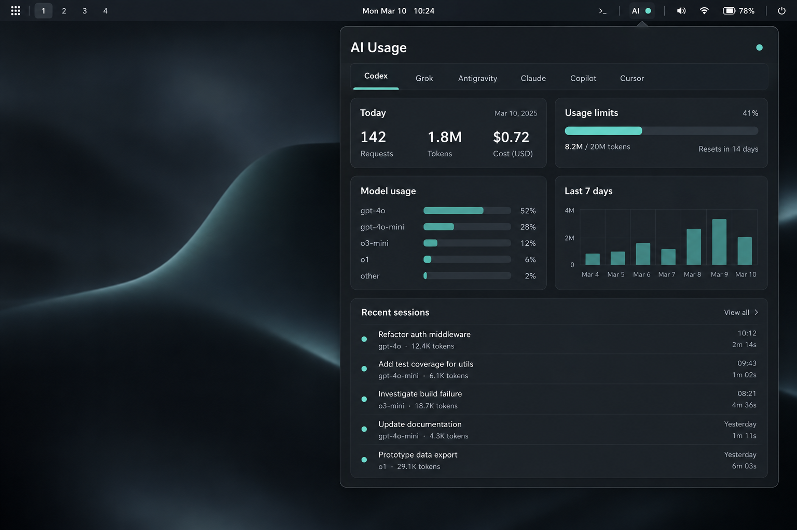

# AI Usage for Omarchy

A single Omarchy bar widget for local AI coding-agent activity. See sessions, usage, models, quotas, recent work, and active agents for Codex, Grok, Antigravity, Claude Code, GitHub Copilot, and Cursor.

The panel opens on the agent with the most recently used local session, including when no agent currently has a running process.



_AI Usage panel preview in Omarchy._

## Features

- One compact bar icon with per-agent activity dots and an optional badge.
- A unified panel for today's usage, seven-day history, tools, models, quotas, and recent sessions.
- Resume recent sessions or start a new session in your preferred terminal.
- Configurable enabled agents, refresh interval, quota alerts, badge mode, and terminal command.
- Local-first data collection. The plugin reads local session and CLI data; it does not upload conversation contents.

## Requirements

- [Omarchy](https://omarchy.org/)
- At least one supported agent CLI installed and signed in: `codex`, `grok`, `agy`, `claude`, `copilot`, or Cursor's `agent` / `cursor-agent`

Agents without an installed CLI remain visible when enabled, with an explanatory status message.

## Install

```bash
omarchy plugin add https://github.com/design-nexus/ai-usage.git --enable
```

The `--enable` flag adds the widget to the bar. To install first and enable later:

```bash
omarchy plugin add https://github.com/design-nexus/ai-usage.git
omarchy plugin enable design-nexus.ai-usage
```

Move the widget after enabling it:

```bash
omarchy bar move design-nexus.ai-usage --section right
```

Use `left`, `center`, or `right` for the destination. Omarchy also supports `--before` and `--after` to position the widget relative to another one.

## Use

| Input | Action |
| --- | --- |
| Left-click | Open or close the usage panel |
| Right-click | Open settings |
| Middle-click | Refresh all enabled agents |
| `1`–`5` | Resume the matching recent session |
| `n` | Start a new session for the selected agent |
| `r` | Refresh |
| `s` | Open settings, or save while in settings |
| `q` | Close the panel |

When the panel opens, it selects the enabled agent with the newest recorded session. It rechecks that choice after the panel's refresh finishes, so the initial tab stays accurate even when activity changed while the panel was closed. Selecting a tab yourself keeps that selection through manual refreshes.

Codex, Grok, and Antigravity sessions can be stopped from their session rows. Claude Code, Copilot, and Cursor sessions can be resumed but do not expose a stop button.

## Settings

Open settings with a right-click or `s`.

- **Agents:** Enable or disable individual provider tabs and refreshes.
- **Refresh interval:** Poll idle agents every 10–1800 seconds; active agents refresh about every 10 seconds.
- **Bar badge:** Show active-session count, today's prompts, or no badge.
- **Quota alerts:** Show a desktop warning when a reported remaining allowance drops below the configured threshold.
- **Terminal:** Use a specific terminal for new and resumed sessions. Leave blank to use `xdg-terminal-exec`.

Settings are saved in Omarchy's `shell.json` widget entry.

## Quota and privacy

Quota values are only shown when a provider exposes enough local account data to support them. Codex, Grok, and Antigravity use locally available data. Copilot may use the signed-in `gh` account or `COPILOT_GITHUB_TOKEN`, `GH_TOKEN`, or `GITHUB_TOKEN`; Cursor reads its local authentication configuration. Claude Code quota is not estimated.

The plugin deliberately does not invent a remaining percentage when the provider does not report one. Local session metadata is used to build the usage view and pick the last-used agent; session contents are not sent anywhere by the plugin.

## Update or remove

```bash
omarchy plugin update design-nexus.ai-usage
omarchy plugin remove design-nexus.ai-usage
```

`omarchy plugin update` without an ID updates every git-installed plugin.

## Development

Run the scanner test suite from the repository root:

```bash
python3 -m unittest discover -s tests -v
```

Plugin code under `~/.config/omarchy/plugins/` hot-reloads when saved. If a reload does not apply, rescan plugins with:

```bash
omarchy-shell shell rescanPlugins
```

## License

[MIT](LICENSE)
